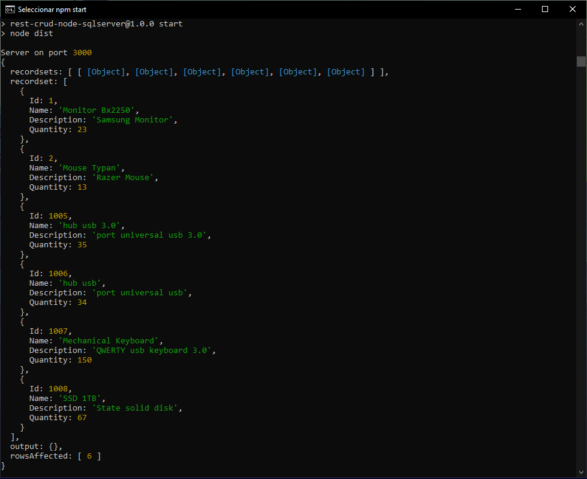

#Rest Crud App with NodeJs and SqlServer

##Aplication Rest Api created with NodeJs and Microsoft SqlServer Database.

#Enviroments Variables

DB_USER = **your_user**
DB_PASSWORD = **your_password**
DB_SERVER = **localhost**
DB_DATABASE = **your_database**

##Example

DB_USER = **ClaseRobot**
DB_PASSWORD = **ClaseRobot**
DB_SERVER = **localhost**
DB_DATABASE = **Products**

